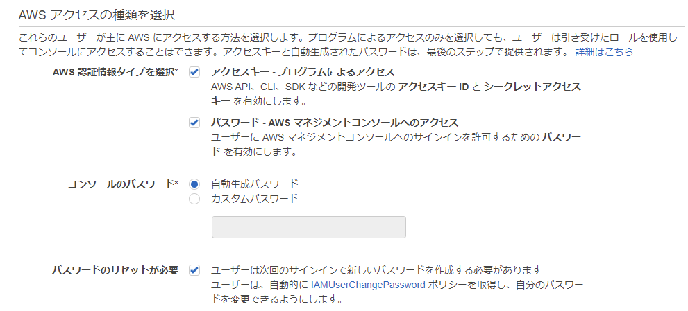
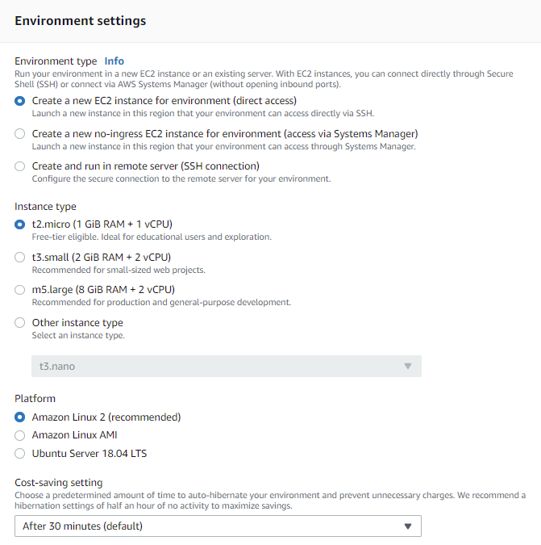

# AWS Cloud9 環境構築

AWSのCloud9でLaravel（バックエンド）とReact（フロントエンド）で開発できる環境を作っていきます。  
AWS Cloud9とは、ブラウザ上で使えるIDE（統合開発環境）で、実行からデバックまで可能なサービスです。  
ブラウザのみでコードが記述可能で、local環境を1から作らなくても以下の設定を行えばすぐに使用することができます。  

___

## 1. AWSアカウント準備

### 1-1. AWS にサインアップ

AWSサインアップ画面にアクセス  
↓  
メールアドレスなどの情報を入力  
↓  
連絡先情報を入力  
↓  
請求情報を入力  
↓  
本人確認  
↓  
サポートプラン  
ベーシックサポートを選択  
↓  
完了  

### 1-2. IAMユーザーを作成

AWSのサービスから「IAM」を選択  
↓  
画面左の「ユーザー」をクリック  
↓  
「ユーザーを追加」ボタンをクリック  
↓  
IAMユーザーの名前設定  
↓  
アクセスの種類を下記のようにする  

  

↓  
アクセス権限を付与  
既存のポリシーを直接アタッチを選択し
「AdministratorAccess」を選択  
↓  
残りの設定はデフォルトのままで
最後に「ユーザーの作成」をクリックで完了

___

## 2. Cloud9のプロジェクト作成

AWSのサービスから「Cloud9」を選択  
↓  
「Create environment」をクリック  
↓  
NameとDescription（任意）を入力  
↓  
Environment settingsが下記のようになっていることを確認  

  

↓  
「Create environment」をクリックして完了  
___

## 3. サーバー環境設定

### 3-1. 初期インストールパッケージの最新化

```
$ sudo yum update -y  
```

### 3-2. タイムゾーンの設定

```
$ sudo timedatectl set-timezone Asia/Tokyo
```

### 3-3. サーバーのハードディスク空き容量増加

```
# dockerアンインストール前のハードディスク使用状況を確認
$ df -h

# dockerがインストールされていることを確認
$ yum list installed | grep docker

# docker用ディレクトリの使用容量確認
$ sudo du -shc /var/lib/*

# dockerのアンインストール実行
$ sudo yum remove docker

# 不要になったdocker用ディレクトリの削除
$ sudo rm -fr /var/lib/docker

# dockerアンインストール後のハードディスク使用状況を確認
$ df -h
```

### 3-4. PHP実行環境のセットアップ

```
# 現在インストールされているPHPのバージョンを確認
$ php --version
→PHP8.0ではない場合、以降の手順を実施。

# PHP8系Remiリポジトリの追加
$ sudo yum -y install http://rpms.famillecollet.com/enterprise/remi-release-7.rpm

# PHP8系Remiリポジトリの優先度設定
$ sudo vim /etc/yum.repos.d/remi-php80.repo
→「[remi-php80]」ブロックの最後に「priority=9」を追加（vimコマンドの操作については下記参照）

# PHP8系パッケージのインストール
$ sudo yum install --enablerepo=remi-php80 php php-mbstring php-mysqlnd php-pdo
→インストール実施確認の直前に出力されるリストにおいて、
指定したインストールパッケージのVersion欄が「8.0」に
なっていることを確認し、インストールを実行する。

# PHPのバージョンを再確認
$ php --version
→PHP8.0になっていればOK。
```

### ※vimコマンド

ターミナル上でファイルを編集するときに使用する。

#### 1. ファイルの指定

```
$ vim ファイル名
→該当するファイルがなければ新しく作成される
```

#### 2. ファイル内容を編集

vimでは以下の3つのモードがある。

|   モード   |                              内容                              | 切り替え方 |
| --------- | -------------------------------------------------------------- | :--------: |
| NormalMode | テキストのコピーやカーソルの移動、ファイルの保存などができる。 | ESC        |
| InsertMode | ファイル内容を編集することができる。                           | i          |
| VisualMode | ファイル内の文字や文字列を選択することができる。               | v          |

vimを起動した直後はNormalModeなので、`i`を押してInsertModeにする。  
編集が終わったら、`ESC`を押してNormalModeに戻す。

#### 3. 編集内容を保存

NormalModeの状態で`:w`と入力して`Enter`を押すと、ターミナル下部に ~~~ written と表示され保存が完了する。

#### 4. エディタを終了

NormalModeの状態で`:q`と入力して`Enter`を押すと、vimが終了し元のターミナルに戻る。  
`:wq`と入力することで、保存と終了を同時に行うことも可能である。
___

## 4. データベース 環境構築


### 4-1. MariaDBのインストール

```
# MariaDBのステータス確認
$ systemctl status mariadb
→「Unit mariadb.service could not be found.」と出力される。

# MariaDBのインストール実行
$ sudo yum install mariadb mariadb-server
→エラーなくインストールが完了する。(最後に「Complete!」と出力される。）

# MariaDBのステータス再確認
$ systemctl status mariadb
→インストールされたMariaDBの情報が出力される。(状態は「inactive」となっている。）

# MariaDBの起動
$ sudo systemctl start mariadb
$ systemctl status mariadb
→MariaDBの状態が「active」となっている。

# MariaDBの接続確認
$ mysql -u root
→正常に接続ができる。

# DB接続を終了する。
MariaDB [(none)]> exit;
→「Bye」の出力と共にLinuxのターミナルに戻る。
```

### 4-2 MariaDBの初期設定

#### 1. 文字コード設定

```
# 現在の文字コード設定を確認
$ mysql -u root -e "show variables like 'char%';"
→表示される結果に「utf8mb4」の設定が存在しない。

# DBのutf8mb4対応確認
$ mysql -u root -e "show charset like '%utf8mb4%';"
→「utf8mb4」の情報が一行出力されればOK。

# DBクライアント側の文字コード変更
$ sudo vim /etc/my.cnf.d/mysql-clients.cnf
→「[mysql]」ブロックに「default-character-set=utf8mb4」を追記する。

# DBクライアント側の文字コードの設定反映確認
$ mysql -u root -e "show variables like 'char%';"
→表示される結果の「character_set_client」「character_set_connection」「character_set_result」が「utf8mb4」になっていればよい。

# DBサーバー側の文字コード変更
$ sudo vim /etc/my.cnf.d/mariadb-server.cnf
→「[mysqld]」ブロックの最後に「character-set-server=utf8mb4」

# DBサーバーの再起動
$ sudo systemctl restart mariadb
$ systemctl status mariadb
→MariaDBの状態が「active」となっている。

# DBクライアント側の文字コードの設定反映確認
$ mysql -u root -e "show variables like 'char%';"
→表示される結果の
「character_set_database」と「character_set_server」が「utf8mb4」となっていればよい。
```

#### 2. 自動起動設定

```
# 起動時にMariaDBが自動起動しないことの確認
$ sudo reboot
→再起動が実行される。

$ systemctl status mariadb
→MariaDBの状態が「inactive」となっている。

# 自動起動設定
$ sudo systemctl enable mariadb
→「Created symlink from 〜」というメッセージが出力される。

# 起動時にMariaDBが自動起動することの確認
$ sudo reboot
→再起動が実行される。

$ systemctl status mariadb
→MariaDBの状態が「active」となっている。
```

### 4-3. DBユーザーの初期設定

#### 1. Rootユーザーのパスワード設定

```
# MariaDB接続&Database切り替え
$ mysql -u root
→mysqlにrootユーザでログイン

MariaDB [(none)]> use mysql;
→mysqlに切り替えが行われる

# userテーブルのrootユーザーに対するパスワード値を更新
MariaDB [mysql]> ALTER USER 'root'@'localhost' IDENTIFIED BY '********';

# 設定したパスワードの確認
MariaDB [mysql]> exit
$ mysql -u root -p
→passwordを聞かれるので設定したpasswordを入力。ログインできればOK。

# DB接続を終了する。
MariaDB [(none)]> exit;
```

#### 2. 新規ユーザー作成

```
# MariaDB接続&Database切り替え
$ mysql -u root -p
→mysqlにrootユーザでログイン

MariaDB [(none)]> use mysql;
→mysqlに切り替えが行われる

# ユーザーの新規作成
# ユーザー名（今回はdbuserとした）とパスワードを設定
MariaDB [mysql]> create user 'dbuser'@'localhost' identified by '********';
→「Query OK, 0 rows affected (0.00 sec)」と出力されれば成功

# 作成ユーザーへのCreate権限付与
MariaDB [mysql]> grant create on *.* to 'dbuser'@'localhost';
→「Query OK, 0 rows affected (0.00 sec)」と出力されれば成功

# 作成ユーザーの確認
MariaDB [mysql]> exit
$ mysql -u dbuser -p
→passwordを聞かれるので設定したpasswordを入力。ログインできればOK。

# DB接続を終了する。
MariaDB [(none)]> exit;
```

### 4-4. データベース作成

```
# MariaDB接続&Database切り替え
$ mysql -u root -p
→mysqlにrootユーザでログイン

MariaDB [(none)]> use mysql;
→mysqlに切り替えが行われる

# 新規データベース作成
MariaDB [mysql]> show databases;
→現時点でのデータベース一覧が表示される。

MariaDB [mysql]> create database TodoApp;
→「Query OK, 1 row affected (0.00 sec)」が出力されればOK

MariaDB [mysql]> show databases;
→作成したデータベースが一覧に表示される。

# ユーザーへの新規データベース権限付与
MariaDB [mysql]> GRANT ALL PRIVILEGES ON TodoApp.* to 'dbuser'@'localhost';
→「Query OK, 0 rows affected (0.00 sec)」と出力されれば成功

# 新規データベース接続確認
MariaDB [mysql]> exit
$ mysql -u dbuser -p TodoApp
→パスワード入力後、正常に接続され「MariaDB [TodoApp]>」と出力されれば成功

# DB接続を終了する。
MariaDB [(TodoApp)]> exit;
```

___

## 5. Laravel 環境構築

### 5-1. Composerのインストール

```
# Composerのインストール
$ curl -sS https://getcomposer.org/installer | php
$ sudo mv composer.phar /usr/local/bin/composer

# composerコマンドとして認識されているかの確認
$ composer
```

### 5-2. Laravelプロジェクトの作成

```
# composerのインストール対象パッケージにlaravelインストーラーをインストール
$ composer global require laravel/installer

# ComposerコマンドにてTodoAppディレクトリ内にLaravelプロジェクト作成
$ composer create-project laravel/laravel --prefer-dist TodoApp "6.*"

# 作成されたLaravelプロジェクト作成のバージョン確認
$ cd TodoApp/
$ php artisan --version
→Laravel Framework 6.20.〇〇になっていればOK
```

### 5-3. Laravelアプリケーションの動作確認

```
## Laravelアプリケーション実行
$ cd TodoApp/
$ php artisan serve --port=8080
```

Preview  
↓  
Preview Running Application  
↓  
Laravelのスタート画面が表示されていればOK。  
終了するときは「Ctrl + c」をおす。

### 5-4. Laravel 初期設定

#### 1. 環境設定ファイル準備

```
# Laravelアプリケーションのルートディレクトリに移動
$ cd ~/environment/TodoApp

# 用意されている .env.exampleファイル(サンプルファイル)を .envファイルにコピー
$ cp .env.example .env

# .envファイルにアプリケーションキーを設定
$ php artisan key:generate

# .envファイルのDB接続関連情報を編集
$ vim .env
```
「DB_」で始まる値を適切な形に変更
```
DB_CONNECTION=mysql
DB_HOST=127.0.0.1
DB_PORT=3306
DB_DATABASE=TodoApp（作成したデータベース名）
DB_USERNAME=dbuser（DBで設定したユーザー名）
DB_PASSWORD=********（設定したパスワード）
```

#### 2. タイムゾーン設定

`config/app.php`内で定義されているtimezoneの値を変更する。
```
$ cd config
$ vim app.php
```
timezoneの値を書き換える。
```
'timezone' => 'Asia/Tokyo',
```
___


## 6. Git 環境構築

### 6-1. Gitパッケージのバージョン確認&最新化

```
# 現時点でインストールされているGitパッケージのバージョン確認
$ git --version

# Gitパッケージの更新実行
$ sudo yum update git
→「No packages marked for update」と表示されれば既に最新の状態なのでOK。

# Gitパッケージのバージョン再確認
$ git --version
```

### 6-2. GitHub間の疎通設定

#### 1. サーバー側のSSH公開鍵・秘密鍵作成

```
# 作成前のSSH関連ディレクトリ配下確認
$ ls -l ~/.ssh/

# 公開鍵・秘密鍵のキーペア作成
$ ssh-keygen -t rsa

# 作成後のSSH関連ディレクトリ配下確認
$ ls -l ~/.ssh/
→「id_rsa.pub」が公開鍵、「id_rsa」が秘密鍵のファイル
```

#### 2. SSH公開鍵をGitHubに設定

GitHubにログイン（未登録の場合は新規アカウント作成）  
↓  
Settings  
↓  
SSH and GPG keys  
↓  
New SSH key  
↓  
title: 何目的の公開鍵か識別できるようにタイトルを設定  
Key: 「id_rsa.pub」ファイルの内容をコピーし貼り付け  
```
# 「id_rsa.pub」のファイル内容をコピー
$ cat ~/.ssh/id_rsa.pub
->ターミナル上にファイル内容が表示されるのでコピーする
```
↓  
Add SSH key  

#### 3. サーバー側SSH設定&疎通確認

```
# SSH設定ファイルの作成 or 変更
$ vim ~/.ssh/config
```

以下の内容を追記
```
Host github
  HostName github.com
  IdentityFile ~/.ssh/id_rsa
  User 自分のGitHubユーザー名
```

疎通確認
```
# SSH設定ファイルの権限設定
$ chmod 600 ~/.ssh/config

# GitHub接続確認
$ ssh -T git@github.com
→「Hi 自分のGitHubユーザー名! You've successfully authenticated, but GitHub does not provide shell access.」
と表示されれば成功
```

### 6-3. Gitコマンドの初期設定

```
$ git config --global user.name "GitHubのユーザ名"
$ git config --global user.email "GitHubの登録アドレス"
$ git config --global core.editor 'vim -c "set fenc=utf-8"'
$ git config --global color.diff auto
$ git config --global color.status auto
$ git config --global color.branch auto
```

### 6-4. Gitリポジトリ初期設定

#### 1. GitHubリポジトリ作成

Your repositories  
↓  
New  
↓  
Repository name: TodoApp(何のレポジトリ識別できる名前)  
Description: 内容の説明（任意）  
Public or Private: どちらでもよい  
↓  
Create repository  

#### 2. サーバー側設定

```
# TodoAppディレクトリに移動
$ cd TodoApp

# カレントディレクトリに対するGit初期設定
$ git init

# バージョン管理状態を確認
# (※パスワードなどの不要ファイルが含まれていないか確認する）
$ git status

# ソース管理されていない全ファイルをステージングに追加
$ git add .

# バージョン管理状態を再確認
$ git status // もう一度確認

# コミットを実行
# (※コミットコメントはどのような変更かを理解できるように）
$ git commit -m "first commit"

# ブランチ名をmasterからmainに変更
$ git branch -M main

# リモートリポジトリの設定
$ git remote add origin git@github.com:ユーザ名/リポジトリ名.

# リモートリポジトリへの反映
$ git push origin main
```

### ※開発中のGitコマンド操作

#### (a)コミット&プッシュの流れ

開発中には常にキリのいいところでコミット&プッシュすることを心掛ける。  
細かくコミット&プッシュすることで、作業のやり直しなどがしやすい。  
コミットだけでも問題ないが、同時にプッシュまでしておくのが無難。  
```
$ git add .

$ git commit -m "ここには変更点などを書く"

$ git push origin main
```

#### (b)ブランチを切って作業する

平行して複数の機能追加やバージョン管理を行う場合、それぞれの作業用ブランチを作成しそこで作業する。

##### 1. ブランチの作成

```
$ git branch
→ローカルリポジトリのブランチ一覧が表示される

# 作業用ブランチ作成
$ git branch branch_for_function1
→mainリモートブランチからbranch_for_function1ローカルブランチを作成

$ git checkout branch_for_function1
→作業ブランチを「branch_for_function1」に切り替え

$ git branch
→ローカルブランチ一覧が表示され、作業ブランチが「branch_for_function1」になっている
```

##### 2. 作業ブランチをプッシュ

```
$ git add .

$ git commit -m "コメント"

$ git push origin branch_for_function1
```

##### 3. GitHub上でのブランチマージ

Compare & Request ボタンを押す  
↓  
Create pull request ボタンを押す  
↓  
Confirm merge ボタンを押す  

##### 4. リモートリポジトリの変更をローカルリポジトリのmainに反映

```
$ git pull origin main
```

___

##環境構築完了！